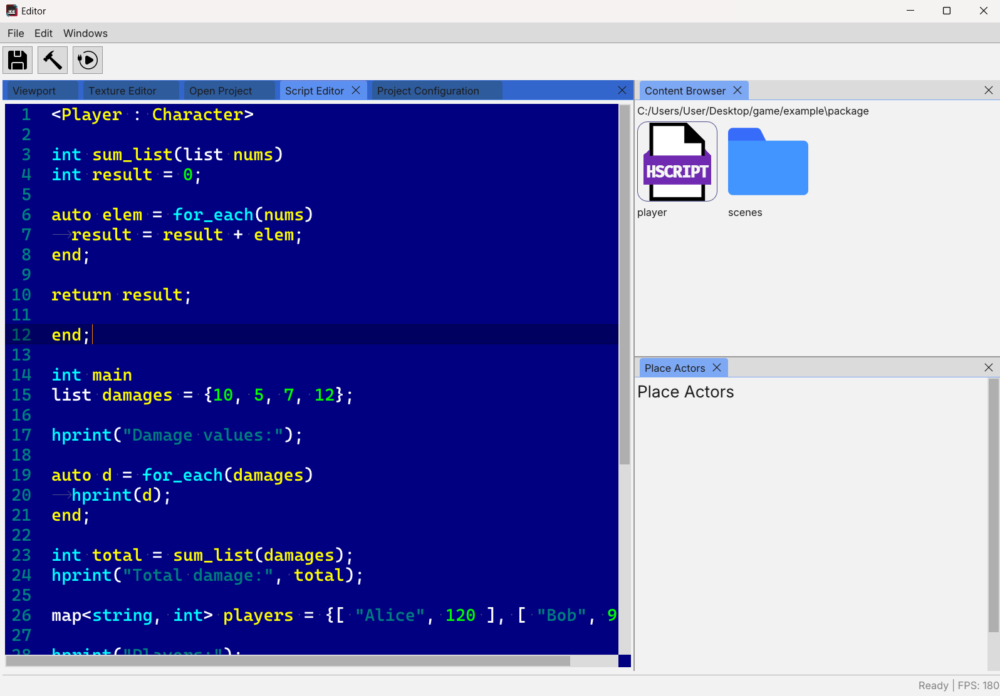
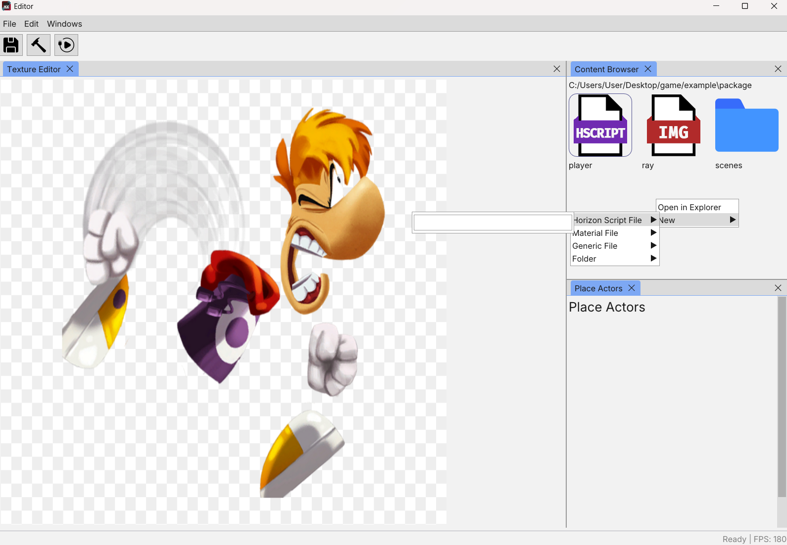
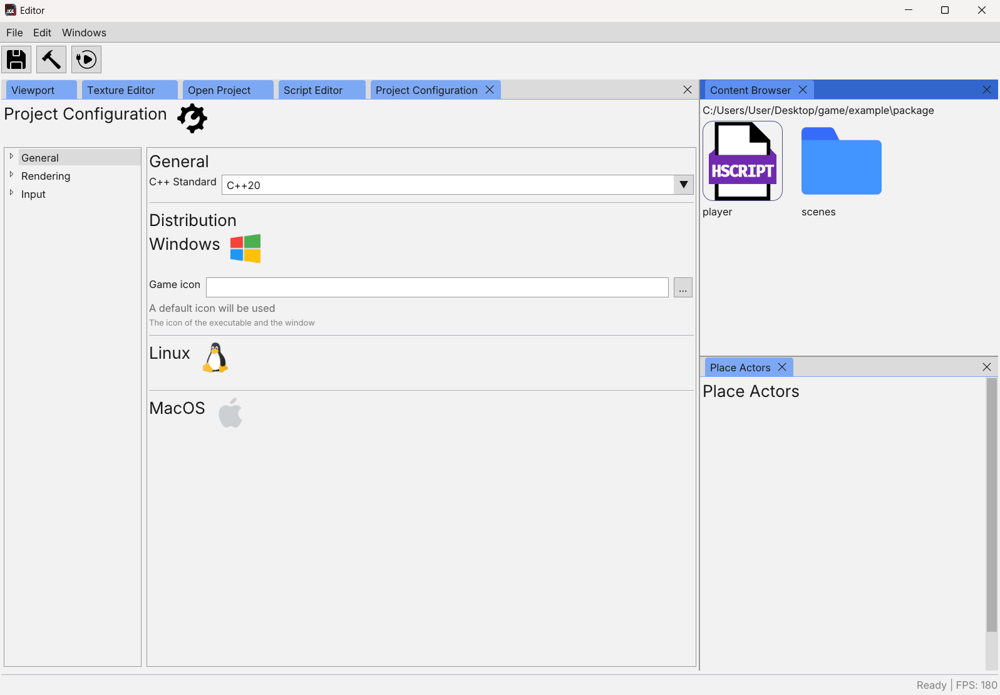

# Horizon Game Engine
Horizon game engine is a 2D oriented game engine based on realtime 3D graphics. It allows you to make games in C++ and in HorizonScript (interpreted proprietary script language).

## Table of Contents

- [C++](#C++)
- [Installation](#installation)
- [Images](#images)
---
Developpers
- [Compile-Engine](#compile-engine)

## C++
HGE allows you to make games using C++ language, engine includes everything to compile. It is recommended to use an IDE.

## Installation
You can download installer at https://oscar-soirey.github.io/Horizon-Game-Engine/ and start developping.

## Images
- Powerful script editor

- Texture editor

- Configuration panel

---

# Developers

## Compile engine
If you want to modify the engine or compile it from source, you can download a compiler with cmake and execute `initial-build.bat`.
HGE is compiled with mingw32-make `GNU Make 4.4.1`